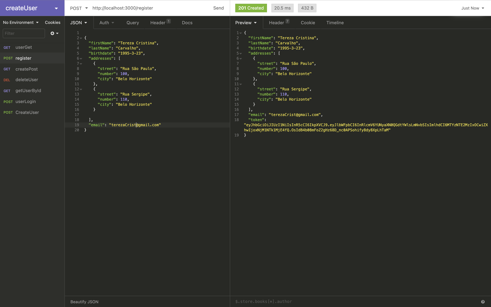

# Desafio Back-end H3ALTHY.

### Libs e frameworks:
* node.js,
* express.js,
* jsonwebtoken,
* mongoDb

### Como rodar a aplicação:
  No seu terminal clone o repositório
  ``` 
  git clone git@github.com:terezasimoes/Health-Backend.git
  ```
  Entre na pasta do projeto 
  ```
  cd Health-Backend
  ```
  Instale as dependências
  ```
  npm install
  ```
  Rodar a aplicação
  ```
  npm start
  ```
  Com uma plataforma de API (Postman ou Insomnia) faça a requisição POST para cadastrar usuário pela rota 
  ```
  http://localhost:3000/register
  ```
  No corpo da requisição adicione os atributos como no exemplo abaixo
  ```
{
	"firstName": "Tereza Cristina",
	"lastName": "Carvalho",
	"birthdate": "1995-3-23",
	"addresses": [
		{
			"street": "Rua São Paulo",
			"number": 100,
			"city": "Belo Horizonte"
		},
		{
			"street": "Rua Sergipe",
			"number": 110,
			"city": "Belo Horizonte"
		}

	],
	"email": "terezaCrist@gmail.com"
}
```
Por fim envie a requisição e verá o retorno como o exemplo abaixo: 


### Como verificar se o usuário foi salvo no banco de dados:

Inicializar o serviço do mongo, digite no terminal:
```
 mongo
 ```
 Para exibir os banco de dados existentes:
 ```
 show dbs
 ```
 Verifique se consta o banco chamado Users como também se a coleção foi criada:
 ```
 show collections
 ```
Por fim, liste os usuários:
```
db.users.find()
````


